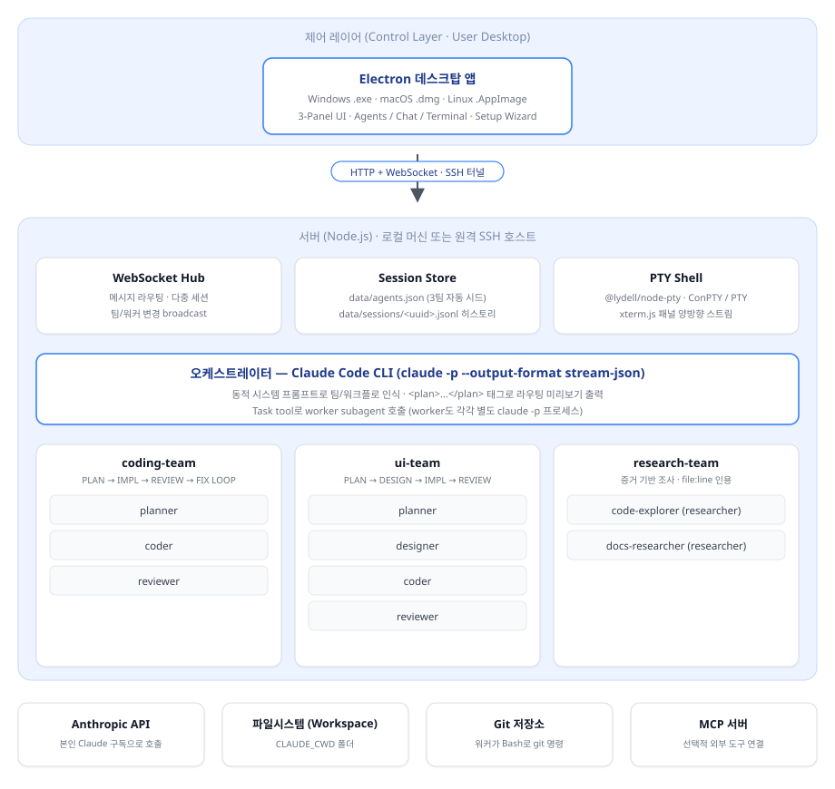

# Claude Multi-Agent Console &nbsp;·&nbsp; v0.16.0

내 컴퓨터에서 돌아가는 데스크탑 / 웹 UI로, **본인 Claude Code 구독**을 멀티 에이전트 시스템으로 활용할 수 있게 해줍니다. 오케스트레이터 + 전문가 워커들 + 팀 + 다중 세션 — 전부 채팅 한 곳에서 조율됩니다.

전부 로컬에서 동작합니다. **본인** Claude Code OAuth 로그인을 그대로 씁니다 (사용량은 본인 Pro/Max 플랜에서 차감, **API 키 필요 없음**).

## 시스템 구성도



데스크탑 앱 → WebSocket → 서버(Node.js) → 오케스트레이터(Claude Code CLI) → 워커 팀(planner/designer/coder/reviewer/researcher) → Anthropic API. 첫 실행 시 `coding-team`·`ui-team`·`research-team` 세 팀이 자동 시드됩니다.

---

## 주요 기능

- **오케스트레이터 채팅** — 위임을 라우팅하는 최상위 Claude와 대화
- **워커** — 전문가 정의 (planner / coder / reviewer / researcher / qa / custom). 각자 역할 프롬프트, 모델, 도구 권한을 따로 설정 가능
- **팀** — 워커들을 그룹화 (예: `coding-team` = planner + coder + reviewer). 오케스트레이터가 한 요청에 팀 전체를 가동
- **자동 워크플로** — 코드 요청에는 계획 → 구현 → 리뷰 → 수정 루프가 자동으로 돎
- **세션 & 히스토리** — 여러 채팅 thread를 탭으로 전환, 재시작에도 유지
- **활동 패널** — 각 위임이 카드로 표시 (워커 이름, 색, 진행률, 결과)
- **상태 미리보기** — 예정 / 진행중 / 완료 열로 분류. 위임 전에 오케스트레이터가 계획을 먼저 선언
- **상단 정보 바** — 로그인한 이메일·요금제·작업 디렉토리 즉시 확인

빈 상태로 시작합니다 — 본인 팀과 워커를 직접 정의하세요.

---

## 공통 요구사항

| 무엇                   | 왜                          | 설치                                 |
| --------------------- | --------------------------- | ----------------------------------- |
| **Node.js 20+**       | 런타임                       | <https://nodejs.org>                |
| **Claude Code CLI**   | 실제 Claude가 돌아가는 도구  | <https://claude.com/code>           |
| **Claude Pro / Max**  | Claude Code 로그인에 필요   | <https://claude.ai/pricing>         |
| **Git**               | 레포 클론                    | <https://git-scm.com>               |

**Claude Code 로그인 (한 번만)** — 어느 OS든 동일:

```bash
claude
```

브라우저가 열리며 OAuth 진행. 본인 Claude 계정으로 로그인. 확인:

```bash
claude auth status
```

`"loggedIn": true` 보이면 OK.

---

## 가장 쉬운 길 — 받아서 더블클릭

[Releases](https://github.com/hanoong7/Claude_Multi_Agent_Console/releases) 페이지에서 본인 OS에 맞는 파일 다운로드 → 어디든 폴더에 넣고 → 더블클릭.

| OS | 파일 |
| --- | --- |
| Windows | `ClaudeMultiAgentConsole-0.16.0.exe` |
| macOS (Apple Silicon) | `ClaudeMultiAgentConsole-0.16.0.dmg` |
| Linux | `ClaudeMultiAgentConsole-0.16.0.AppImage` |

**처음 실행하면 설정 마법사가 뜹니다.** Local / Remote 모드를 드롭다운으로 선택하고 필요한 경로/포트만 입력하면 자동으로 `config.json`이 생성됩니다 — 손으로 만들 필요 없어요.

### macOS 추가 안내

코드 사이닝을 안 한 빌드라 Gatekeeper가 처음 실행을 막습니다. 다음 중 하나로 우회:

- **권장**: Finder에서 `.app` 우클릭 → **Open** → 경고창에서 다시 **Open**. (이후로는 그냥 더블클릭 가능)
- 또는 터미널에서: `xattr -cr /Applications/Claude\ Multi-Agent\ Console.app`
- 또는: System Settings → Privacy & Security → "Open Anyway"

Intel Mac(x64)은 현재 지원 안 합니다.

### Quick start 1. 로컬 단독 실행

`.exe` (또는 `.dmg` / `.AppImage`) 더블클릭만 하면 끝.

**첫 실행**: 설정 마법사가 뜸 → 모드 드롭다운에서 **Local** 선택 → 작업할 폴더의 절대 경로 입력 → Save & Continue. 같은 폴더에 `config.json`이 자동 생성됨.

**다음 실행부터**: 마법사 안 뜨고 워크스페이스 입력창만 뜸. 마지막 선택이 미리 채워져 있어서 Enter만 눌러도 됨.

- 경로가 존재하지 않거나 폴더가 아니면 에러 메시지 뜨고 다시 입력 요구
- `~`로 시작하면 자동으로 홈 디렉토리 확장
- 매번 묻는 게 귀찮으면 자동 생성된 `config.json`에서 `"askWorkspaceOnLaunch": false`로 변경

### Quick start 2. GUI 없는 Linux 서버 + 로컬 데스크탑 (원격 서버를 데스크탑 창에서)

이 패턴이 동작하는 그림:

```
[로컬]                                          [원격 Linux 서버]
  ClaudeMultiAgentConsole-0.16.0.exe             ~/Claude_Multi_Agent_Console/
  (또는 .dmg / .AppImage)  ──SSH 터널──▶  node app.js ──┐
       │                                                 │ Claude CLI 호출
       │                                                 ▼
       └─ Electron 창 ◀────── HTTP/WebSocket ────── claude.ai
                                       (8787)
```

로컬에는 **다운로드한 실행 파일 하나만** 있으면 됩니다. `config.json`은 첫 실행 시 마법사가 자동 생성. Claude CLI · Node.js · 워크스페이스 다 원격에서 돌아갑니다.

---

#### 사전 준비 — 원격 Linux 서버 (한 번만)

서버에 SSH로 접속해서:

```bash
# 1. Node.js 20+ 확인
node --version

# 2. Claude Code CLI 설치 (없으면)
#    https://claude.com/code 참고

# 3. 로그인 (서버에서!) — 브라우저 OAuth 한 번
claude

# 4. 레포 클론 — 홈 디렉토리에 두는 게 가장 단순
cd ~
git clone https://github.com/hanoong7/Claude_Multi_Agent_Console.git
```

이러면 서버에 `/home/<유저이름>/Claude_Multi_Agent_Console/` 가 생깁니다. **이 경로 기억해두세요** — config.json의 `path` 필드에 들어갑니다.

> 다른 경로에 두고 싶으면 그래도 됩니다. config.json의 `path`에 그 경로를 적으면 됨 (홈 기준 상대경로 또는 `/`로 시작하는 절대경로 둘 다 가능).

서버는 직접 띄울 필요 없어요. 로컬에서 .exe 실행할 때 SSH로 자동 시작됩니다.

---

#### 사전 준비 — 로컬 Windows (한 번만)

**A. SSH 키 인증 셋업** (이미 돼있으면 건너뛰기)

PowerShell에서:

```powershell
# 키가 없으면 생성 (Enter만 쭉 눌러도 됨)
ssh-keygen -t ed25519

# 공개키를 서버에 등록 (서버 비밀번호 한 번 입력)
type $env:USERPROFILE\.ssh\id_ed25519.pub | ssh -p <SSH포트> <user>@<서버주소> "mkdir -p ~/.ssh && cat >> ~/.ssh/authorized_keys"

# 확인 — 비밀번호 안 묻고 바로 들어가야 정상
ssh -p <SSH포트> <user>@<서버주소>
```

**B. SSH config 별칭 등록** (`C:\Users\<당신>\.ssh\config` 파일에 추가, 없으면 만들기)

```
Host myserver
    HostName 1.2.3.4         # 또는 example.com
    Port 22                  # 비표준이면 변경
    User myname              # 서버 로그인 유저명
```

저장 후 `ssh myserver`만 쳤을 때 바로 들어가면 OK. 비밀번호 물으면 A단계가 안 된 거예요.

**C. 실행 파일 다운로드 & 첫 실행 설정**

1. [Releases](https://github.com/hanoong7/Claude_Multi_Agent_Console/releases) 가서 본인 OS 파일 다운로드 (`.exe` / `.dmg` / `.AppImage`)
2. 원하는 위치에 폴더 만들기 (예: `C:\Apps\AgentConsole\`)
3. 다운받은 실행 파일을 그 폴더에 넣고 더블클릭
4. **설정 마법사**가 뜸 → Mode 드롭다운에서 **Remote** 선택 → 아래 정보 입력 → Save & Continue

| 마법사 필드 | 값 | 예시 |
|---|---|---|
| SSH host or alias | `~/.ssh/config`의 별칭 또는 `user@host` | `myserver` 또는 `myname@1.2.3.4` |
| Remote install path | 서버에서 클론한 레포 경로 — 홈 기준 상대경로 또는 절대경로 | `Claude_Multi_Agent_Console` 또는 `/home/myname/projects/Claude_Multi_Agent_Console` |
| Remote workspace path | 서버에서 워커가 작업할 디렉토리 (절대 경로) | `/home/myname/projects/api` |
| Local port | 로컬에서 쓸 포트 | `8787` |
| Remote port | 서버에서 띄울 포트 | `8787` |

Save & Continue 누르면 마법사가 SSH로 원격 워크스페이스 존재 여부를 검증한 뒤 같은 폴더에 `config.json`을 생성합니다. 폴더 최종 모양:

```
C:\Apps\AgentConsole\
├── ClaudeMultiAgentConsole-0.16.0.exe
├── config.json     ← 자동 생성
└── workspace.json  ← 자동 생성
```

---

#### 실행 — 매번

`.exe` 더블클릭만.

내부적으로:
1. config.json 읽음
2. SSH 터널 자동 열기 (`ssh myserver -L 8787:localhost:8787`)
3. 서버 디렉토리에서 `node app.js` 자동 실행 (PROD=1, PORT 환경변수 자동 설정)
4. /health 응답 확인 (최대 30초)
5. Electron 창 표시
6. 창 닫으면 SSH 터널 + 원격 서버 같이 정리

원격 모드에서도 실행 시 **워크스페이스 경로 입력창**이 떠요. 거기에 원격 서버의 절대 경로를 입력하면 됩니다 (예: `/home/myname/my-project`). SSH로 자동 검증해서 없는 경로면 에러 띄움. `"askWorkspaceOnLaunch": false`로 끄거나, config.json의 `remote.workspace`에 미리 적어두면 매번 묻지 않아요.

**잘 안 되면** 빨간 에러 다이얼로그가 떠요. 자주 보이는 원인:
- "SSH connection... didn't yield a healthy server" → 위 사전 준비 A/B 다시 확인 (PowerShell에서 `ssh myserver` 했을 때 비번 없이 들어가는지)
- 서버에 Node.js 없음 → 서버에 `node --version` 안 되면 Node 20+ 설치
- 서버에 Claude CLI 로그인 안 됨 → 서버에서 `claude auth status` 했을 때 `loggedIn: true` 여야 함

---

## 직접 빌드하기 (개발자용)

`.exe`를 직접 만들고 싶으면:

```powershell
git clone https://github.com/hanoong7/Claude_Multi_Agent_Console.git
cd Claude_Multi_Agent_Console
npm install
npm run dist:win    # → dist-installers/ClaudeMultiAgentConsole-0.16.0.exe
```

Linux: `npm run dist:linux` → `.AppImage`. Mac (Apple Silicon): `npm run dist:mac` → `.dmg` (Mac 머신 필요).

> v0.16.0부터 `start.sh` / `start.bat` / `npm start` 같은 수동 실행 경로는 더 이상 제공하지 않습니다. 배포는 `.exe` / `.dmg` / `.AppImage` 한 가지 경로로만 진행됩니다.

---

## 사용법

### 첫 실행

빈 상태로 시작합니다. 좌측 상단 `+ team` 버튼으로 팀 만들고, 팀 헤더에 마우스 올려서 `+ member` 로 멤버 추가.

### 본인 팀 정의

1. `+ team` 클릭 → 이름 + 목적 ("언제 이 팀을 부를지?")
2. 팀 헤더 hover → `+ member` → 멤버 정의:
   - **kind**: researcher / planner / designer / coder / reviewer / qa / custom (기본 역할 프롬프트 자동 채워짐)
   - **role**: 그 워커의 시스템 프롬프트
   - **model**: opus / sonnet / haiku / inherit
   - **effort**: low / medium / high / xhigh / max
   - **permission**: 도구 실행 권한 (아래 참고)
3. 오케스트레이터 시스템 프롬프트가 자동으로 팀과 워크플로를 인지

**추천 시작 셋업**: `coding-team` 만들고 안에 planner(kind=planner) / coder(kind=coder) / reviewer(kind=reviewer) 3명 추가. 이 조합이면 코드 요청 시 자동으로 plan → code → review → fix-loop 워크플로 가동.

### 권한 모드

| 모드                  | 동작                                                          |
| -------------------- | ------------------------------------------------------------ |
| `default`            | Claude Code 기본. 프롬프트 뜰 수 있음 — 헤드리스에선 비추.       |
| `acceptEdits`        | 파일 편집 + 기본 fs 명령 자동 허용 (Bash `git` 같은 거)         |
| `bypassPermissions`  | ⚠ 모든 권한 체크 스킵. 신뢰하는 워크플로일 때.                  |
| `plan`               | 읽기 전용 계획 모드                                            |
| `dontAsk`            | allowlist 외 모두 거부 (CI 스타일로 잠긴 모드)                  |

코드 작성 워크플로엔 워커에 `acceptEdits` 권장. 도구 prompt에 자꾸 막히면 오케스트레이터를 `bypassPermissions`로 올리세요.

### 작업 디렉토리 (workspace)

매 실행마다 **워크스페이스 경로 입력창**이 떠요. 거기에 절대 경로를 적으면 그 폴더가 작업 디렉토리가 됩니다. 마지막 선택이 기억돼서 다음 실행 때 미리 채워짐. 상단 정보 바에 현재 경로 표시 (📁 아이콘).

매번 묻는 게 귀찮으면 `.exe` 옆에 자동 생성된 `config.json`에서 `"askWorkspaceOnLaunch": false`로 변경 (저장된 마지막 폴더를 그대로 사용).

### 포트

기본 `8787`. `config.json`의 `remote.localPort` / `remote.remotePort` 또는 처음 실행 시 마법사에서 변경 가능.

---

## 파일/폴더 구조

```
release-folder/
├── app.js              ← 번들된 서버 (수정 불가)
├── electron-main.mjs   ← 데스크탑 앱 진입점
├── public/             ← UI 에셋 (수정 불가)
├── data/               ← 본인 팀/워커/세션/설정 (자동 생성)
│   ├── agents.json
│   └── sessions/
│       └── <session-uuid>.jsonl
└── workspace/          ← Claude/워커가 만드는 파일 (자동 생성)
```

`data/`와 `workspace/`는 gitignored — 자유롭게 수정/삭제해도 됨.

---

## 트러블슈팅

**"Claude is not logged in" 배너** — 터미널에서 `claude` 한 번 실행, 로그인 후 페이지 새로고침.

**"Claude CLI not installed" 배너** — <https://claude.com/code> 에서 설치 → 셸 재시작 → 재시도.

**채팅에 "claude exited (1)..."** — 권한 또는 인증 이슈. `claude auth status`로 로그인 확인. 도구 호출이 계속 실패하면 오케스트레이터 권한을 `bypassPermissions`로 변경.

**워커가 워크플로 무시 / 위임 안 함** — 각 워커의 `description`이 트리거 키워드를 포함하는지 확인. 그리고 팀에 `planner / coder / reviewer` 기본 kind들이 있어야 자동 워크플로가 동작.

**포트 점유 충돌** — `config.json`의 `remote.localPort` (또는 `remote.remotePort`)를 비어 있는 포트로 변경 후 재실행. 로컬 모드는 자동으로 빈 포트를 잡으므로 보통 문제 안 됨.

**완전히 처음부터 다시** — 앱 끄고 `data/` (선택적으로 `workspace/`도) 삭제, 다시 실행.

---

## 비용 & 프라이버시

- 모든 Claude 호출은 **본인** 머신에서 **본인** Claude Code 로그인을 통해 Anthropic으로 직접 갑니다.
- 사용량은 본인 Pro/Max 플랜에서 차감.
- 채팅 히스토리, 에이전트 정의, 워커 출력 모두 본인 디스크의 `data/`에만 저장. 어디로도 업로드되지 않음.

---

## 한계 / 알려진 이슈

- **소스 코드는 포함되지 않음.** 사전 빌드 번들입니다.
- 같은 서버에 여러 브라우저 탭을 띄우면 한 백엔드 연결을 공유 — 동작은 하지만 세션 간 동시 실행은 안 됨
- "예정 (pending)" 미리보기는 오케스트레이터가 지시를 따라야 동작. 가끔 plan 태그를 빼먹습니다.
- 모바일 레이아웃 없음
- 왼쪽 패널 너비 조정은 가능한데 새로고침하면 초기화

---

## 라이센스

MIT — `LICENSE` 참고.
